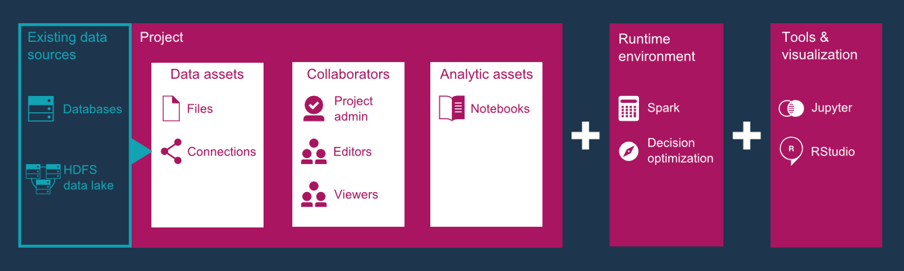

# Automated Feature Engineering and Model Scoring using Watson Studio Local

> First a quick note - until just recently, Watson Studio Local was named Data Science Experience (DSX) Local. Please note this as some of the links below may still refer to the product using the old name.

The focus of this code pattern is to provide a start-to-finish workflow that demonstrates the features and capabilities available in the new release of IBM's Watson Studio Local.

In this blog post we will:

* Describe what the new code pattern does,
* Provide a brief overview of Watson Studio Local, and
* Explain how a user can train and deploy a model leveraging the capabilities of Watson Studio Local and Watson Machine Learning

### What machine learning techniques are covered in this code pattern?

In this code pattern, we attempt to use the chemical properties of wines to classify them into one of 3 categories. The wine properties are provided by a distributed data set from [kaggle](https://www.kaggle.com/brynja/wineuci).

To extract the relevant properties required to classify a wine, Principal component analysis (PCA) is applied to the data set. PCA is a popular dimensionality reduction technique which is used to reduce N number of numerical variables into few principal components that are used as features in the machine learning model. These principal components capture a major percentage of the combined variance effect of all the variables.

For the classification model, Logistic regression (a popular machine learning model) is applied to the extracted components to predict the wine categories.

### What is Watson Studio Local?

[IBM Watson Studio Local](https://content-dsxlocal.mybluemix.net/docs/content/local/overview.html) is an out-of-the-box on-premises solution for data scientists and data engineers. It addresses the entire Data Science life cycle and provides an environment where data scientists can work with a variety of tools such as Spark, R, Python, and Anaconda - all integrated to work together in a productive collaborative experience. Either due to GDPR or other data privacy-related issues, **Watson Studio Local is perfect for users wanting to perform complex data science related work in the security of their private network**.

Aside from running notebooks, Watson Studio also provides projects for multi-tenancy and collaboration, identity hooks for LDAP, an admin console for management, a community tab for finding sample content, integration with GitHub and GitHub Enterprise, oh, and it's deployable to IBM's popular [IBM Cloud Private](https://www.ibm.com/analytics/cloud-private-for-data). An architectural overview of Watson Studio Local is below.

## How can I get started?

* Try the code pattern out. Check it out by going directly to our [GitHub repo](https://github.com/IBM/model-mgmt-on-watson-studio-local). The code pattern will walk the user through creating Watson Studio Local assets, running the notebook, and lastly interpreting  the results.

* Want to see the notebook results directly? Use [NBViewer](http://nbviewer.jupyter.org/) to view one of our code pattern notebooks, for example [this one](http://nbviewer.jupyter.org/github/IBM/model-mgmt-on-watson-studio-local/blob/master/notebooks/pca-features.ipynb) that performs feature engineering on our wine data set.

* Keep an eye on [IBM Code](https://developer.ibm.com/code/patterns/) for more Watson Studio related patterns!

### Read more: 

* https://medium.com/ibm-watson/check-out-whats-new-with-watson-studio-93a31f173245
